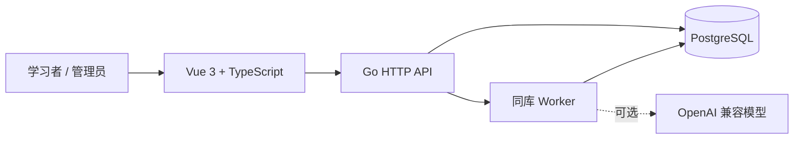

<div align="center">

# AI 刷题

**让每一次答题，都变成下一次进步的依据。**

JLPT 学习平台 · 批次练习 · 延迟反馈 · 知识点追踪 · AI 批次分析

[](https://github.com/jiliaoyo/aitest/actions/workflows/ci.yml)
[](https://go.dev/)
[](https://vuejs.org/)
[](https://www.postgresql.org/)

[快速开始](#快速开始) · [产品亮点](#产品亮点) · [技术架构](#技术架构) · [参与贡献](#参与贡献)

</div>

## 这是什么？

AI 刷题是一个可自托管的 JLPT 学习平台。

它关注的不是“完成了多少题”，而是每一批练习之后，能不能清楚回答：

- 哪些知识点正在反复出错？
- 这一次的判断依据是什么？
- 下一批练习应该从哪里开始？

系统把确定性判分、权威答案和 AI 分析分开呈现。AI 不可用时，基础判分和学习记录仍然正常工作。

## 产品亮点

| 能力 | 解决的问题 |
| --- | --- |
| **批次练习，延迟反馈** | 答题过程中不被即时对错打断，提交本批练习后统一查看结果 |
| **AI 批次分析** | 一次分析整批表现、薄弱知识点和下一步建议，避免逐题调用造成噪声和成本 |
| **分层结果** | 确定性结果、权威答案和 `AI 判定(可能有误)` 分开统计，不混淆事实与解释 |
| **知识点画像** | 记录累计正确率、连续错误和近期表现，支持专项练习与可解释推荐 |
| **可追溯题库** | 题目版本不可变，保留来源、章节、材料和答案依据 |
| **自托管优先** | Go + PostgreSQL + Vue 3 + Docker，数据和模型配置掌握在自己手里 |

仓库当前附带的本地题库快照包含 **2,063 道题目、5,161 个题目版本、1,132 个知识点**。

## 当前功能

- JLPT 级别、科目、知识点树和来源章节管理
- 综合练习、知识点专项练习、错题重练和 AI 个性化练习
- 自动保存、断线恢复、幂等提交和练习历史
- 单选、多选、填空、简答等题型
- 确定性判分、权威答案和 AI 判定分层展示
- 知识点统计、薄弱点推荐和错题本
- 管理端题目版本、材料、答案、知识点和来源维护
- TXT、Markdown、CSV、DOCX、可提取文字 PDF 导入
- 本地扫描 OCR 服务与结构化 JSON 导入管线

## 技术架构



- **前端**：Vue 3、TypeScript、Vite、原生 CSS token，无 UI 组件库
- **后端**：Go 模块化单体，手写 SQL，API 与 worker 可同进程或分进程运行
- **数据库**：PostgreSQL；迁移目录中的 `0001_auth.sql` 是当前结构基线
- **AI**：兼容 OpenAI Chat Completions 的模型服务，AI 为可选能力
- **部署**：Docker Compose，包含 PostgreSQL、API、worker、frontend

### 安全边界

- 答题前接口不返回 `answer_keys` 或正确答案
- 会话使用 HttpOnly Cookie，数据库只保存 token 哈希
- 写操作校验 Origin，接口按用户身份隔离数据
- 提交使用幂等键，避免重复记录和重复判分
- 题目编辑创建新版本，不覆盖历史题目事实

## 快速开始

### 本地开发

依赖：Go 1.24+、PostgreSQL 16+、Node 20+。

```bash
# 1. 创建开发数据库
createdb ai_shuati_dev

# 2. 初始化结构与演示数据
cd backend
make migrate

# seed 只读取本地环境中的密码，不把固定密码写入代码或 Git
export SEED_ADMIN_PASSWORD='自定义管理员密码'
export SEED_LEARNER_PASSWORD='自定义学习者密码'
make seed

# 3. 启动 API
make dev
```

另开终端启动前端：

```bash
cd front-web
npm install
npm run dev
```

打开 <http://localhost:5173>。未配置 `AI_BASE_URL`、`AI_API_KEY`、`AI_MODEL` 时，确定性判分仍可使用。

### 导入完整本地题库快照

快照包含考试目录、知识点、来源、材料、题目版本、权威答案和 AI 题目数据；不包含用户、会话、练习记录和创建者字段。

在空数据库中执行迁移后导入，先知识点、后题库：

```bash
cd backend
export PG_URL='postgres://postgres@localhost:5432/ai_shuati_dev?sslmode=disable'
psql "$PG_URL" -f questions/current_knowledge_points.sql
psql "$PG_URL" -f questions/current_question_bank.sql
```

快照已经包含内容目录，不要和 `make seed` 混用；导入后可以直接注册新账号。

### Docker

```bash
# 在仓库根目录创建 .env，至少设置：
# POSTGRES_PASSWORD=自定义数据库密码
# PUBLIC_ORIGIN=http://localhost:9091

docker compose up -d postgres
docker compose run --rm backend /app/migrate -dir /app/migrations
docker compose exec -T postgres psql -U ai_shuati -d ai_shuati < backend/questions/current_knowledge_points.sql
docker compose exec -T postgres psql -U ai_shuati -d ai_shuati < backend/questions/current_question_bank.sql
docker compose up -d backend worker frontend
```

## 常用命令

```bash
# 后端
cd backend
make test
make build
make worker

# 前端
cd front-web
npm test
npm run build
```

## 题库导入与重建

`backend/questions/` 保存当前本地数据库快照，适合在空库中快速恢复内容。

如果需要从 OCR 结构化数据重新生成书籍题库，使用开发管线，并将生成文件放到临时目录：

```bash
python3 scripts/rebuild_question_bank.py --out-dir /tmp/ai-shuati-generated-questions
```

扫描书导入服务位于 `ocr-service/`：上传 PDF → 本地 OCR → 人工审核 → 结构化 JSON → 管理端导入。

## 参与贡献

欢迎提交 Issue 和 Pull Request，尤其是：

- 新题型、判分规则和边界测试
- 知识点分类质量与来源校对
- 前端可访问性和移动端体验
- 更多考试类型与自托管部署文档

开始改动前请先阅读 `docs/` 下的产品、前端和后端规范。

## 数据与许可证

- 应用代码的开源许可证需要在仓库根目录单独声明；本仓库当前不默认授予代码以外内容的再分发权。
- `backend/questions/` 和扫描导入资料包含书籍衍生题库；相关版权归原出版者或权利人所有，公开部署和再分发前请确认授权范围。
- API 密钥、数据库连接串、部署环境变量和本地 `.env` 不应提交到 Git。

## 目录结构

```text
backend/       Go API、worker、迁移与数据库结构
front-web/     Vue 3 学习端与管理端
ocr-service/   扫描 PDF 的本地 OCR 审核服务
scripts/       题库解析、校验和导出工具
docs/          产品与工程规范
```
